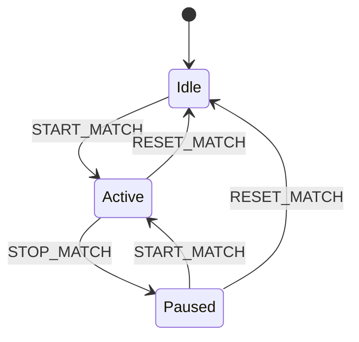

# Protocolo de Comunicación Serial

Este documento detalla el protocolo de comunicación serial entre el software de puntuación (Python) y el microcontrolador PIC18F4550.

## 🔌 Especificaciones Físicas

- **Velocidad:** 9600 baud
- **Formato:** 8N1 (8 bits, sin paridad, 1 bit de stop)
- **Control de Flujo:** Ninguno
- **Voltaje:** TTL 5V (usar adaptador USB-Serial si es necesario)

## 📦 Formato de Paquete

```
[START_BYTE][CMD][DATA_LEN][DATA...][CHECKSUM][END_BYTE]
```

Donde:
- **START_BYTE:** 0xAA (1 byte)
- **CMD:** Comando (1 byte)
- **DATA_LEN:** Longitud de datos (1 byte)
- **DATA:** Payload variable (0-255 bytes)
- **CHECKSUM:** XOR de CMD + DATA_LEN + DATA (1 byte)
- **END_BYTE:** 0x55 (1 byte)

## 📝 Comandos

| Comando | Valor | Descripción | Datos |
|---------|-------|-------------|-------|
| UPDATE_SCORE | 0x01 | Actualizar puntajes | [red_score, blue_score] |
| UPDATE_TIMER | 0x02 | Actualizar temporizador | [minutes, seconds] |
| START_MATCH | 0x03 | Iniciar partida | None |
| STOP_MATCH | 0x04 | Detener partida | None |
| RESET_MATCH | 0x05 | Reiniciar partida | None |
| PING | 0x06 | Verificar conexión | None |
| SET_LED | 0x07 | Control de LEDs | [alliance, state] |

### Detalles de Comandos

#### UPDATE_SCORE (0x01)
- **Datos:** 2 bytes
  - Byte 1: Puntaje rojo (0-99)
  - Byte 2: Puntaje azul (0-99)
- **Ejemplo:**
  ```
  AA 01 02 32 14 24 55  # Red=50, Blue=20
  ```

#### UPDATE_TIMER (0x02)
- **Datos:** 2 bytes
  - Byte 1: Minutos (0-99)
  - Byte 2: Segundos (0-59)
- **Ejemplo:**
  ```
  AA 02 02 01 1E 1D 55  # 1:30
  ```

#### START_MATCH (0x03)
- **Datos:** None
- **Ejemplo:**
  ```
  AA 03 00 03 55
  ```

#### STOP_MATCH (0x04)
- **Datos:** None
- **Ejemplo:**
  ```
  AA 04 00 04 55
  ```

#### RESET_MATCH (0x05)
- **Datos:** None
- **Ejemplo:**
  ```
  AA 05 00 05 55
  ```

#### PING (0x06)
- **Datos:** None
- **Respuesta:** 0xAA 0xCC 0x55
- **Ejemplo:**
  ```
  AA 06 00 06 55  # Request
  AA CC 00 CC 55  # Response
  ```

#### SET_LED (0x07)
- **Datos:** 2 bytes
  - Byte 1: Alianza (1=Red, 2=Blue)
  - Byte 2: Estado (0=Off, 1=On)
- **Ejemplo:**
  ```
  AA 07 02 01 01 05 55  # Red LED ON
  ```

## 🔒 Validación

### Checksum
El checksum se calcula como XOR de:
1. Byte de comando
2. Byte de longitud de datos
3. Todos los bytes de datos

```python
checksum = cmd ^ data_len
for byte in data:
    checksum ^= byte
```

### Errores Comunes
- **Paquete Inválido:** Ignorar si no comienza con START_BYTE
- **Checksum Incorrecto:** Descartar paquete
- **Longitud Inválida:** Descartar si DATA_LEN > 10
- **Fin Incorrecto:** Ignorar si no termina con END_BYTE

## 📊 Ejemplos de Sesión

### Inicio de Partida
```
PC->PIC: AA 05 00 05 55         # Reset match
PIC->PC: AA CC 00 CC 55         # ACK
PC->PIC: AA 02 02 02 30 34 55   # Set timer 2:30
PC->PIC: AA 03 00 03 55         # Start match
```

### Actualización de Puntaje
```
PC->PIC: AA 01 02 05 03 05 55   # Red=5, Blue=3
```

### Fin de Partida
```
PC->PIC: AA 04 00 04 55         # Stop match
PC->PIC: AA 07 02 01 00 06 55   # Red LED off
PC->PIC: AA 07 02 02 00 07 55   # Blue LED off
```

## 🛠 Debugging

### Monitor Serial
```bash
# Linux
minicom -D /dev/ttyUSB0 -b 9600

# Windows
# Usar PuTTY o terminal de Arduino IDE
```

### Herramienta de Test
```python
python examples/serial_test.py --port COM3
```

## 📝 Notas de Implementación

### Python (Host)
```python
def send_packet(cmd, data):
    packet = bytearray()
    packet.append(0xAA)           # START
    packet.append(cmd)            # CMD
    packet.append(len(data))      # LEN
    packet.extend(data)           # DATA
    packet.append(calculate_checksum(packet[1:]))
    packet.append(0x55)           # END
    serial.write(packet)
```

### C (PIC)
```c
void process_packet(void) {
    uint8_t cmd = uart_read();
    uint8_t len = uart_read();
    uint8_t data[10];
    
    for(uint8_t i = 0; i < len; i++) {
        data[i] = uart_read();
    }
    
    uint8_t checksum = uart_read();
    uint8_t end = uart_read();
    
    if(validate_packet(cmd, len, data, checksum, end)) {
        execute_command(cmd, data);
    }
}
```

## 🔄 Estados y Transiciones



## ⚠️ Manejo de Errores

1. **Pérdida de Conexión**
   - Host reintenta 3 veces
   - PIC muestra "Err" en display

2. **Datos Corruptos**
   - Verificar checksum
   - Solicitar reenvío si necesario

3. **Buffer Overflow**
   - Límite de 10 bytes de datos
   - Descartar paquetes grandes

## 📚 Referencias

- [UART en PIC18F4550](https://ww1.microchip.com/downloads/en/devicedoc/39632c.pdf)
- [PySerial Documentation](https://pythonhosted.org/pyserial/)
- [Serial Protocol Best Practices](https://blog.mbedded.ninja/programming/serial-protocols/)
